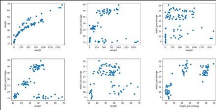
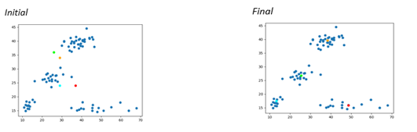
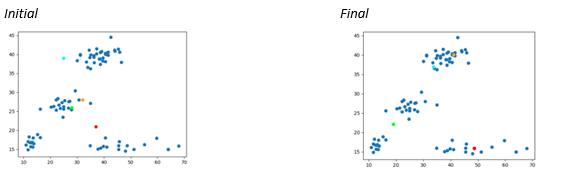

# K-Means Clustering
This is a K-Means Clustering algorithm that was done for the Principles of Programming Languages course. 

Principles of Programming Languages

# Project: K-Means Clustering on a fish dataset

Team Members: An Le, Vlad Tusinean, and Matthew Vojvodin

## Key Idea:

The purpose of this project was to perform K-Means Clustering a dataset involving two attributes.

## What is K-Means Clustering?

K-Means Clustering is a method of grouping that splits a certain number of iterations into _k_ clusters (or groups) These clusters can be groups via certain attributes of a dataset to make the clusters obvious, such as height, color, sex, etc.

## What is the dataset and how did was it partitioned?

The dataset that the group worked with for this project is the fish dataset that was obtained from _datahexa_. Within the default dataset, the dataset has 7 categories:

- Species
- Weight
- Length1
- Length2
- Length3
  - Since Length1 and Length2 are subsets of Length3, these columns were omitted.
- Height percentage
- Width percentage

For the group&#39;s implementation of K-Means clustering, we analyzed the graph of the dataset and determined that the K value is 4.

  - It was verified by Professor Abedalrhman Alkhateeb that choosing a K value would be acceptable

It was also suggested by Professor Abedalrhman Alkhateeb that choosing 2 attributes would also be suitable for this project scope.

Looking through the dataset, the group figured that it would have been wise to choose the combination of attributes that would create the most distinct clusters.

In order to do this, we coded a graph for each combination in Python, and this was the result:

Observing the multiple graphs, it was clear to see that the graph in the bottom left gave the most clear and distinct clusters.

Therefore, it was decided that the two attributes that were to be used were:

  - Length
  - Height percentage

## Implementation

The core implementation was done via a functional paradigm: Racket (which is a fork of Scheme).

Implementing the K-Means clustering involved:

  - Generating centroids that are randomized based on K-Bags.
  - Finding distance between the centroids and all the datapoints in the dataset and associate said datapoints with the closest centroid.
  - Afterwards, we update the position of the centroids to the mean of each centroids&#39; closest datapoints.
  - We repeat the process until centroids do not change position.
  - The result of this would ideally allow the centroids to find each individual cluster and center itself within it.
  - The clustering is then considered complete.

After the core implementation, the visual representation of each iteration was done via Python to show the adjustment of each centroid at every iteration.

The racket file can be inspected for further documentation.

## Issues noticed during implementation

The implementation was proceeding very smoothly until a strange bug was encountered. The centroids would either converge or diverge from the clusters depending on the randomization. After running some tests and debugging the code, the group was able to figure out what the problem was.

The clustering would fail or succeed depending on what position the initial centroids are placed in.

**Case 1: Successful run (Fortunate starting point of the centroids)**

In this case, it can be observed that the 4 centroids within the dataset have all been placed in convenient locations that allow the K-Means clustering algorithm to function properly. The four centroids can identify which cluster they should associate with and iteratively move to the center of said clusters.

**Case 2: Failed run (Unfortunate starting point of the centroids)**

In this case, it can be observed that the 4 centroids within the dataset have been placed in very odd locations for the initial iteration. Due to this, the associativity of the centroids does not work the way it is supposed to, as one centroid associates to two different clusters (which results in it being stuck in the middle of the two) and two other centroids attempt to associate to one cluster.

Upon speaking with Professor Abedalrhman Alkhateeb, it was learned that this was a problem that was inherent to the K-means clustering algorithm.

## Our Solution

A partial solution to this issue (one that reduces the chances of divergence) was to implement &#39;K-bags&#39;. Essentially, rather than randomly generating the position of the centroids based on a random from max and min, partition the list of elements into K disjoint sub-lists and take the average of each sub-list. This guarantees that the centroids will be within the data, and random. Also, if the random sub-list contains multiple elements from a specific cluster, the centroid position for that sub-list would immediately favor that cluster.

## Results

The group was able to create a successful K-Means algorithm within the functional paradigm &#39;Racket&#39;. The algorithm successfully sets centroids amongst the dataset and it generally successfully detects clusters within it. Not only that, but the implementation of the &#39;K-bags&#39; method to solve an edge case was successful, allowing for a significantly lower failure rate. This was verified through multiple test cases.

## Execution

### Required Libraries

    Racket - CSV Writing (Can be installed within DrRacket)
    Python - Matplotlib, numpy, pandas (for visual representation)
In order to properly execute the project, one must:

- Run kmeans.rkt - kmeans.rkt will generate a CSV file &#39;centroids.csv&#39;
- Run Graph\_KMeans.py – This python program provides a visual representation of the centroids&#39; movement.
- To move to the next iteration of the algorithm, hit enter in the terminal.
- The program exits after the final iteration of kmeans.

A &#39;centroidsFantastic.csv&#39; file will be provided. The initial positions of the centroids in this case excellently demonstrate the K-Means Clustering algorithm. To use this file, change &#39;centroids.csv&#39; to &#39;centroidsFantastic.csv&#39; in Graph\_Kmeans.py.

